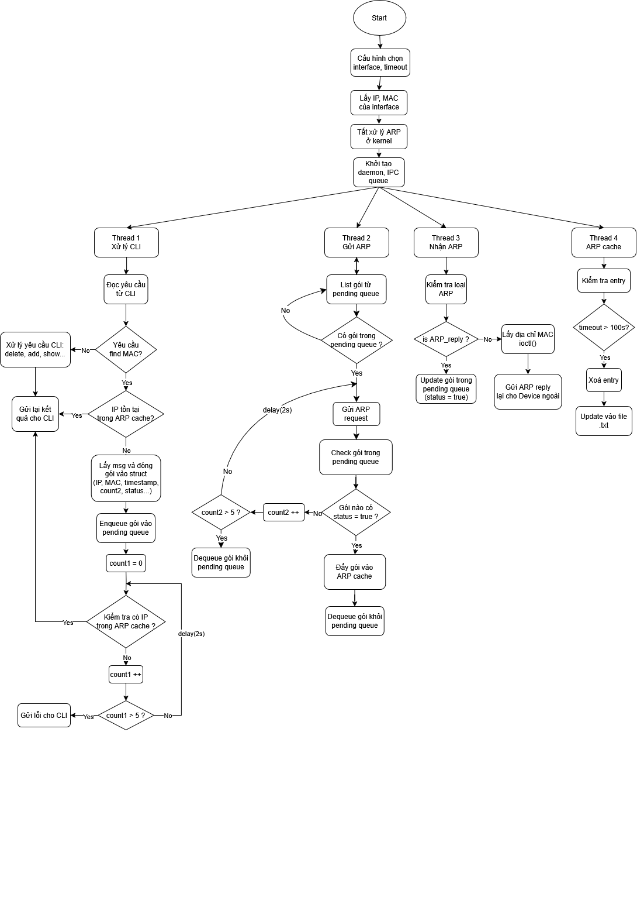
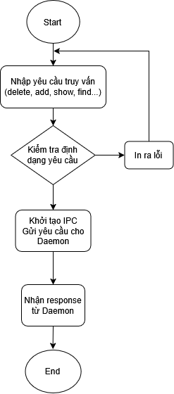
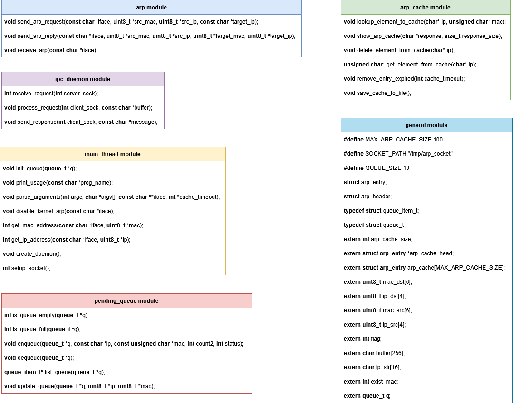

# Software Design Description
## For ARP Implementation using Raw Socket

Version 0.3
Prepared by Pham Hong Duong  
 
Table of Contents
=================
* 1 [Introduction](#1-introduction)
  * 1.1 [Document Overview](#11-document-overview)
  * 1.2 [Document Purpose](#12-document-purpose)
  * 1.3 [Keyworks](#13-keyworks)
  * 1.4 [References](#14-references)
* 2 [Design](#2-overall-description)
    * 2.1 [Context](#21-context)
    * 2.2 [Implementation](#22-implementation)
    * 2.3 [System Model](#23-system-model)
    * 2.4 [Algorithm flowchart](#24-algorithm-flowchart)
    * 2.5 [Modules Structure in Daemon process](#25-modules-structure-in-daemon-process)
    * 2.6 [Running the code](#26-running-the-code)

## 1. Introduction
Document này là cung cấp mô tả thiết kế phần mềm cho việc implement bộ giao thức **ARP** tương tự trên **Linux OS**. Document sẽ mô tả các yêu cầu, thiết kế, và các chi tiết implement phần mềm **ARP** => giúp hiểu rõ về cách hệ thống hoạt động và tương tác với mạng.
### 1.1 Document Overview
Tài liệu này được chia thành các phần sau:
- Phần 1: Mục đích tài liệu và mô tả hệ thống.
- Phần 2: Thiết kế phần mềm chi tiết.
### 1.2 Document Purpose
Project này sẽ triển khai giao thức **ARP** trong **userspace**, sử dụng **raw socket** để nhận và gửi các gói **ARP Request** và **ARP Reply**. Các feature chính bao gồm:
- Truy vấn trong **ARP cache** tự định nghĩa (add, delete, show, find...).
- Gửi và nhận các gói **ARP Request**, **ARP Reply** và quản lý **ARP cache** với **timeout**.
- Hoạt động trực tiếp trên tầng **userspace** mà không thông qua **kernel network stack**.
### 1.3 Keywordsfeature
- **ARP**: Address Resolution Protocol, giao thức mapping địa chỉ IP -> địa chỉ MAC thuộc L2 trong cùng 1 network.
- **Raw Socket**: Loại socket nhận data từ L2 trong kernel network stack và bypass lên thẳng userspace.
- **Daemon**: Process chạy ngầm không phụ thuộc vào terminal, sẽ kết thúc khi tắt nguồn.
- **Cache Timeout**: Thời gian sống của một entry trong ARP table để lookup sự mapping giữa địa chỉ IP và địa chỉ MAC, sau thời gian này entry sẽ bị xóa.
- **CLI**: Command-line interface, giao diện dòng lệnh tương tác trực tiếp với người dùng.
- **ioctl**: Hàm tương tác với hardware, trong bối cảnh sử dụng  thì hàm này sẽ dùng để get địa chỉ IP từ 1 NIC cụ thể.
- **IPC**: cơ chế giao tiếp giữa các process với nhau, trong bối cảnh này thì giao tiếp giữa daemon process và CLI process.
- **NIC**: nơi truyền và nhận trực tiếp các gói tin mạng raw chưa qua xử lý, trong bối cảnh này sẽ sử dụng 2 card wifi để tương tác với nhau (trên cùng 1 host).
- etc...
### 1.4 References
- RFC 826 - "Ethernet Address Resolution Protocol"
- "Unix Network Programming" - Example of Raw Sockets
- Linux Interface Programming guide
- etc... 
## 2. Design
### 2.1 Context
Hệ thống bao gồm một **daemon** chạy nền chịu trách nhiệm quản lý **ARP cache** và xử lý các yêu cầu gửi, nhận **ARP Request** và **ARP reply**. **CLI** được thiết kế để tương tác với **daemon** thông qua **IPC**, cho phép thực hiện các thao tác trên **ARP cache** như **add**, **delete**, **show** và **find** các mục trong **cache**. **CLI** cung cấp các lệnh như `add <IP> <MAC>` để thêm một cặp **IP-MAC** vào **ARP** **cache**, `delete <IP>` để xóa một mục khỏi **cache**, `show` để hiển thị toàn bộ **ARP cache** và `find <IP>` để kiểm tra xem một **IP** có trong **cache** hay không. Khi nhận lệnh tìm kiếm một **IP** chưa có trong **cache**, **daemon** sẽ gửi **ARP Request** lên mạng và cập nhật **cache** khi nhận được **ARP Reply**. Giao tiếp giữa **CLI** và **daemon** đảm bảo **CLI** có thể truy vấn **ARP cache** nhanh chóng và **daemon** có thể tự động cập nhật địa chỉ **MAC** khi cần thiết. Để tránh xung đột với xử lý **ARP** của **kernel**, hệ thống sẽ vô hiệu hóa **ARP** trên **interface mạng** bằng lệnh `ip link set dev <interface> arp off`, đảm bảo mọi yêu cầu **ARP** đều do **daemon** quản lý. Ngoài ra, **daemon** cũng có thể nhận các **ARP Request** từ bên ngoài và **ARP Reply** với địa chỉ **MAC** tương ứng của nó, thay thế hoàn toàn vai trò của **kernel**.
### 2.2 Implementation
- **Daemon**:
  + Chạy nền dưới dạng process.
  + Cho phép cấu hình user (iface, timeout ARP cache) trước khi chạy.
  + Lấy địa chỉ IP, MAC của iface được chọn.
  + Tắt xử lý ARP tại kernel network stack.
  + Giao tiếp với CLI qua IPC.
  + Gửi và nhận ARP request/reply.
  + Lưu trữ ARP cache có timeout.
  + Xuất file lưu trữ ARP cache.
- **CLIs**:
  + Nhận lệnh từ người dùng để thông báo tới daemon.
  + Hiển thị kết quả mà daemon trả lại.

### 2.3 System Model

**Mô tả quá trình hoạt động:**
  - Tắt xử lý **ARP** trong **Kernel**:
      - Lệnh `ip link set dev <interface> arp off` được sử dụng để tắt chức năng xử lý **ARP** của **Linux**.
      - Điều này ngăn **Kernel** tự động phản hồi **ARP reply** hoặc gửi **ARP request**.

  - **Daemon** trong **Userspace** thay thế **Kernel** xử lý **ARP**:
      - **CLI** tương tác với **Daemon** thông qua **IPC**.
      - **Daemon** thực hiện hai tác vụ chính với **ARP Cache**:
          - **POST**: Lưu các mục **ARP** mới vào **cache**.
          - **GET**: Truy vấn từ **ARP cache**.
      - **Daemon** có thể xuất **ARP cache** ra **file** để lưu trữ.

  - Trao đổi **ARP** giữa **Host A** và **các Host khác**:
      - Khi một tiến trình trên **Host B** (ví dụ **CLI** thực hiện lệnh **ping**) cần biết địa chỉ **MAC** của **Host A**, nó sẽ gửi **ARP Request**.
      - **Host A** không để **Kernel** phản hồi mà **Daemon** trong **Userspace** sẽ tiếp nhận **ARP Request**, gửi lại ARP reply địa chỉ MAC của chính nó.
      - **Daemon** phân tích yêu cầu từ **CLI**, nếu **CLI** yêu cầu tìm 1 **IP** không có trong **ARP cache**, daemon sẽ gửi **ARP Request** tới các **Host** khác để tìm kiếm địa chỉ **MAC** phù hợp.

### 2.4 Algorithm flowchart
#### a. Daemon

#### b. CLI

#### c. Giao tiếp ngoại 

### 2.5 Modules Structure in Daemon process

**Chức năng từng module:**
 - **general module**: Chứa các định nghĩa dùng chung, các struct, khai báo các biến extern.
 - **main_thread module**: Chứa các hàm được khởi tại ở main thread của daemon.c
 - **ipc_daemon module**: Chứa các hàm giao tiếp với CLI và phân tích yêu cầu từ CLI.
 - **arp module**: Chứa các hàm gửi, nhận ARP request và ARP reply.
 - **arp_cache module**: chứa các hàm quản lý ARP cache table.
 - **pending_queue module**: chứa các hàm quản lý pending queue.

### 2.6 Running the code
- Chạy **Daemon process** ở Terminal 1:
  - `$ cd Code_Daemon`
  - `$ make`
  - `sudo ./daemon -i <interface> -t <timeout>`
- Chạy **CLI process** ở Terminal 2:
  - `$ cd Code_CLI`
  - `$ make`
  - `$ sudo ./cli`
 

